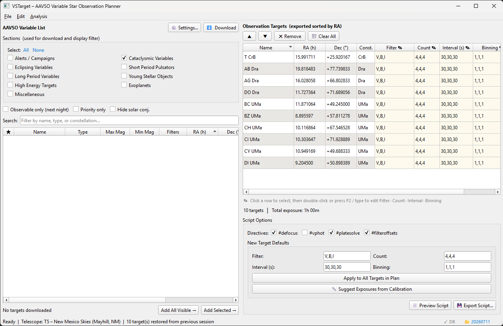
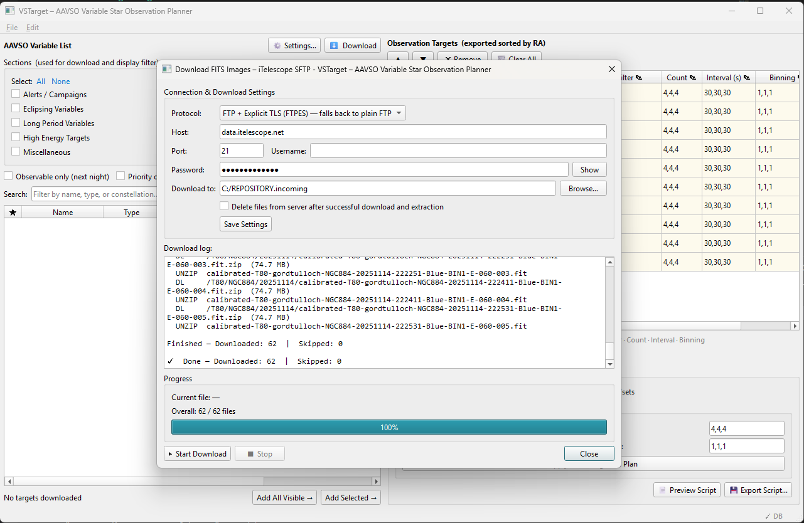
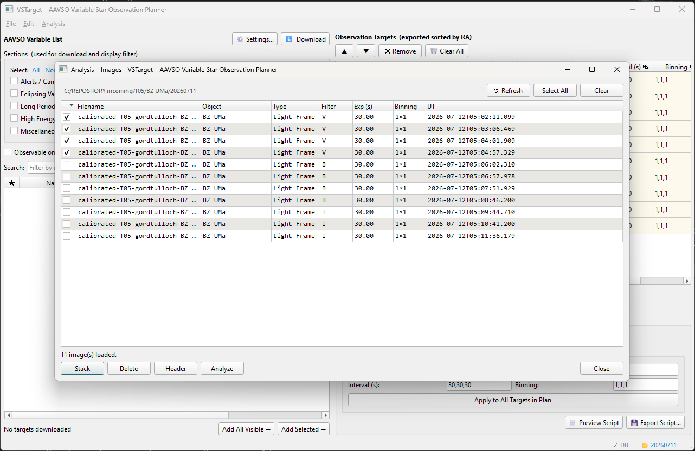
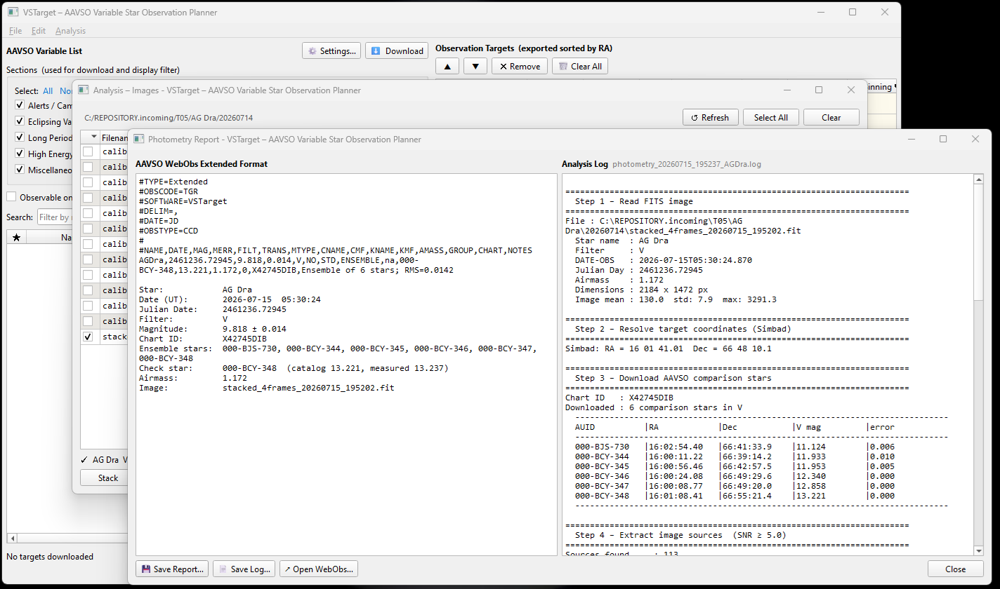
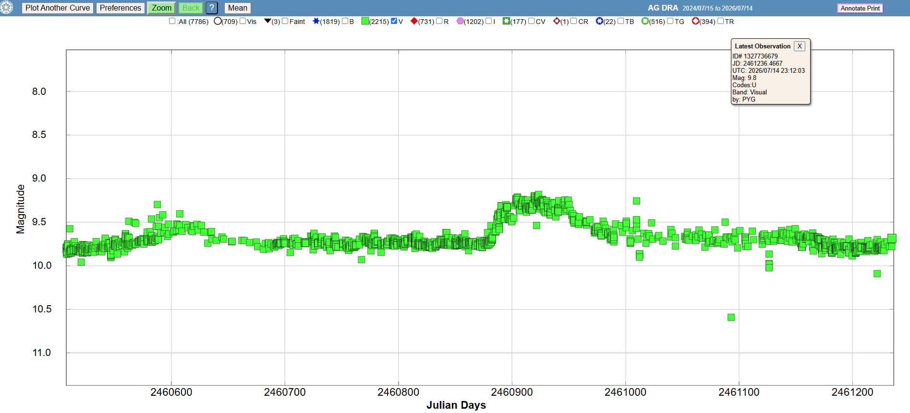

# VSTarget – AAVSO Variable Star Observation Planner

A desktop application that downloads variable star targets from the [AAVSO Target Tool](https://targettool.aavso.org/TargetTool) and builds observation plans that can be exported as [iTelescope](https://www.itelescope.net/) ACP observing scripts. Once the images have been taken, VSTarget can download the calibrated FITS files from iTelescope, plate-solve and stack them, and run aperture photometry to produce an AAVSO WebObs Extended-format report ready for submission.

---

## Features

- **Download targets** from the AAVSO Target Tool API, filtered by any combination of observing sections (Alerts & Campaigns, Cataclysmic Variables, Eclipsing Variables, Long Period Variables, etc.)
- **Variable List** – sortable, searchable table with priority highlighting, solar conjunction warnings, and right-click links to AAVSO VSX and WebObs
- **Import from file** – load a tab-separated or space-delimited `.txt` / `.tsv` star list; constellation is extracted automatically from the star name
- **Observation Plan** – add targets from the list, reorder with ▲/▼ buttons or column-header sorting, delete with the `Delete` key
- **Per-target script parameters** – inline-editable Filter, Count, Interval (s), and Binning columns with cream tint and F2 / double-click editing
- **Global ACP directives** – toggle `#defocus`, `#vphot`, `#platesolve`, and `#filteroffsets`
- **Live summary** – running star count and total exposure time updated incrementally as targets are added or removed
- **Export script** – generates an iTelescope ACP `.txt` plan sorted by Right Ascension, with per-target `#filter` / `#count` / `#interval` / `#binning` directives
- **Persistent plan** – observation plan is automatically saved to a local SQLite database and restored on next launch
- **Settings** – configurable API key, telescope location presets (T5, T7, T11, T24, T17, T21, T30, Custom), default script parameters, and download credentials

### Image analysis

- **Download FITS images** – retrieve `calibrated*.fit.zip` files from the iTelescope data server over FTP (explicit TLS with plain-FTP fallback) or SFTP, mirroring the remote folder structure and unzipping automatically
- **Images panel** – list FITS images in a working directory with header details, WCS status, and buttons to view headers, stack, plate-solve, or analyze
- **Plate solving** – solve images with the [ASTAP](https://www.hnsky.org/astap.htm) command-line solver, writing the WCS solution back to the FITS header
- **Stacking** – photometric mean stacking with star registration (astroalign)
- **Aperture photometry** – Simbad target lookup, AAVSO VSP comparison stars, ensemble linear regression, and a per-run plain-text log file
- **AAVSO report** – results formatted as a WebObs Extended submission file that can be previewed and saved
- **Exposure calculator** – calibrate each telescope/filter's throughput from your own images (**📏 Calibrate Exposure** in the Images panel), then let the Targets panel suggest per-target exposures sized for the star's faint end, capped so comparison stars never saturate, with a warning if the bright end could
- **Transformation coefficient generator** – calculate AAVSO UBVRI transformation coefficients from your own standard-field images (M67, NGC 7790, M11, NGC 1252, NGC 3532, Melotte 111, or a Landolt field), with interactive per-transform outlier review

---

## Screenshots

**Main window — variable list and observation plan:**



**Downloading calibrated FITS images from iTelescope:**



**The analysis Images panel listing calibrated frames for stacking, plate solving, and photometry:**



**Photometry report on AG Dra measuring V = 9.818 ± 0.014, with the step-by-step analysis log:**



**The AAVSO light curve for AG Dra — the most recent observation by other observers (mag 9.8) matches the value VSTarget measured:**



---

## Requirements

| Requirement | Version | Used for |
|-------------|---------|----------|
| Python | 3.10 or later | |
| PySide6 | 6.5.0 or later | User interface |
| requests | 2.28.0 or later | AAVSO API access |
| paramiko | 3.0.0 or later | SFTP image download |
| astropy | 5.0 or later | FITS files, WCS, coordinates |
| numpy | 1.22 or later | Image processing |
| astroalign | 2.4 or later | Star registration for stacking |
| pandas | 1.5 or later | Photometry tables |
| photutils | 1.5 or later | Aperture photometry |
| astroquery | 0.4.6 or later | Simbad target lookup |
| matplotlib | 3.5 or later | Interactive transform-coefficient review plot |

See [requirements.txt](requirements.txt) for the full list, including optional packages that improve stacking quality.

Plate solving additionally requires the free [ASTAP](https://www.hnsky.org/astap.htm) solver (with a star database) installed separately. VSTarget looks for it on the `PATH` and in common install locations; the path can be overridden in **Settings**.

---

## Installation

### Prerequisites

- **Python 3.10 or later**
- **Git** (to clone the repository; a downloaded ZIP works too)
- An **AAVSO account with API key** is required to download targets from the AAVSO Target Tool.
  [Register here](https://targettool.aavso.org/TargetTool/default/user/register) if you do not have one, then generate an API key from your account settings page.
- **[ASTAP](https://www.hnsky.org/astap.htm)** (with a star database) is only required for plate solving — the Planning workflow and most of the Analysis workflow work without it. See [Installing ASTAP](#installing-astap-optional-required-for-plate-solving) below.

---

### Windows

1. **Install Python 3.10+** (skip if already installed — check with `python --version` in a terminal).
   Download the installer from [python.org/downloads](https://www.python.org/downloads/windows/) and run it. On the first installer screen, check **"Add python.exe to PATH"** before clicking Install.

2. **Install Git** (skip if already installed — check with `git --version`).
   Download from [git-scm.com/download/win](https://git-scm.com/download/win) and run the installer with default options. Alternatively, download VSTarget as a ZIP from GitHub (**Code → Download ZIP**) and skip the `git clone` step below.

3. **Clone the repository** — open PowerShell:

   ```powershell
   git clone https://github.com/gordtulloch/VSTarget.git
   cd VSTarget
   ```

4. **Create and activate a virtual environment:**

   ```powershell
   py -m venv .venv
   .venv\Scripts\Activate.ps1
   ```

   > **PowerShell execution policy** – if activation fails with a script execution error, run this once and try again:
   > ```powershell
   > Set-ExecutionPolicy -Scope CurrentUser RemoteSigned
   > ```

5. **Install dependencies:**

   ```powershell
   pip install -r requirements.txt
   ```

6. **Install ASTAP** if you plan to plate-solve images — see [below](#installing-astap-optional-required-for-plate-solving).

7. **Launch:**

   ```powershell
   python main.py
   ```

   You can also skip activating the environment and run it directly:
   ```powershell
   .venv\Scripts\python main.py
   ```

---

### macOS

1. **Install Python 3.10+** (skip if already installed — check with `python3 --version`).
   The system Python on macOS is too old or absent for this app; install a current version via [Homebrew](https://brew.sh/):

   ```bash
   /bin/bash -c "$(curl -fsSL https://raw.githubusercontent.com/Homebrew/install/HEAD/install.sh)"   # if Homebrew isn't installed yet
   brew install python@3.12 git
   ```

   (Xcode Command Line Tools, `xcode-select --install`, provide `git` if you'd rather not install it via Homebrew.)

2. **Clone the repository:**

   ```bash
   git clone https://github.com/gordtulloch/VSTarget.git
   cd VSTarget
   ```

3. **Create and activate a virtual environment:**

   ```bash
   python3 -m venv .venv
   source .venv/bin/activate
   ```

4. **Install dependencies:**

   ```bash
   pip install -r requirements.txt
   ```

5. **Install ASTAP** if you plan to plate-solve images — see [below](#installing-astap-optional-required-for-plate-solving).

6. **Launch:**

   ```bash
   python main.py
   ```

> **macOS Gatekeeper** – PySide6 bundles its own Qt libraries and may trigger a security prompt ("cannot be opened because the developer cannot be verified") on first run. If the app fails to start, open **System Settings → Privacy & Security**, scroll to the blocked-item notice, and click **Allow Anyway**.
>
> **Apple Silicon (M1/M2/M3/M4)** – all dependencies in `requirements.txt` ship native `arm64` wheels; no Rosetta translation is needed.

---

### Linux

Instructions assume a Debian/Ubuntu or Fedora/RHEL desktop; adjust package names for other distributions.

1. **Install Python 3.10+, pip, venv, and git** (most distros ship a recent enough Python — check with `python3 --version`):

   ```bash
   # Ubuntu/Debian
   sudo apt update
   sudo apt install python3 python3-venv python3-pip git

   # Fedora/RHEL
   sudo dnf install python3 python3-pip git
   ```

2. **Install Qt/OpenGL runtime libraries** required by PySide6 (a minimal server/WSL install often lacks these):

   ```bash
   # Ubuntu/Debian
   sudo apt install libgl1 libegl1 libxcb-cursor0 libxkbcommon-x11-0

   # Fedora/RHEL
   sudo dnf install mesa-libGL libxcb libxkbcommon-x11
   ```

3. **Clone the repository:**

   ```bash
   git clone https://github.com/gordtulloch/VSTarget.git
   cd VSTarget
   ```

4. **Create and activate a virtual environment:**

   ```bash
   python3 -m venv .venv
   source .venv/bin/activate
   ```

5. **Install dependencies:**

   ```bash
   pip install -r requirements.txt
   ```

6. **Install ASTAP** if you plan to plate-solve images — see [below](#installing-astap-optional-required-for-plate-solving).

7. **Launch:**

   ```bash
   python main.py
   ```

> **Wayland** – if the window fails to appear or renders incorrectly under a Wayland compositor, force the XCB (X11) backend:
> ```bash
> QT_QPA_PLATFORM=xcb python main.py
> ```

---

### Installing ASTAP (optional, required for plate solving)

VSTarget shells out to the free **[ASTAP](https://www.hnsky.org/astap.htm)** command-line solver to add WCS coordinates to FITS images (**🔭 Plate Solve** in the Images panel). It is not required to plan observations, download images, stack, or run photometry on already-solved images — only for the plate-solve step itself.

1. Download the ASTAP program **and** a star database (the default **D50** database, ~700 MB, covers most fields down to mag 17; use **D80** for narrower/deeper fields) from [www.hnsky.org/astap.htm](https://www.hnsky.org/astap.htm) → *Download* page, matching your OS.
2. Install to a standard location so VSTarget finds it automatically:

   | OS | Recommended install path |
   |----|---------------------------|
   | Windows | `C:\Program Files\astap\` (installer default) |
   | macOS | `/opt/homebrew/bin/astap` (Homebrew) or any location added to `PATH` |
   | Linux | `/usr/bin/astap` or `/usr/local/bin/astap` (package/manual install), or any location added to `PATH` |

3. If installed elsewhere, VSTarget will not find it automatically — open **Edit → Settings** and set the **ASTAP path** explicitly to the `astap` / `astap.exe` binary.

VSTarget searches, in order: the `astap`/`astap.exe` binary on `PATH`, then the standard locations above, then the `astap_path` setting.

---

## First-time Setup

1. Launch the application.
2. Open **Edit → Settings** (`Ctrl+,`).
3. On the **API** tab, paste your AAVSO API key.
4. On the **Telescope** tab, select a preset (e.g. *T5 – New Mexico Skies*) or choose *Custom* and enter your observatory coordinates.
5. Optionally adjust the **Script Defaults** tab (filter, count, interval, binning).
6. To download images after your observing runs, enter your iTelescope data-server credentials on the **Download** tab.
7. Click **OK**.

Settings are stored in your OS's standard application data directory and persist across sessions.

---

## Usage

### Downloading Targets

1. In the **AAVSO Variable List** panel (left), check the observing sections you are interested in (e.g. *Alerts / Campaigns*, *Cataclysmic Variables*).
2. Optionally enable **Observable only** to restrict results to targets visible from your telescope location during the next night.
3. Click **⬇ Download**.

Use the **Search** box or the **Priority only** / **Hide solar conj.** checkboxes to filter the displayed list.

### Adding Targets to the Plan

- **Double-click** a row in the Variable List, or select one or more rows and click **Add Selected →**.
- Click **Add All Visible →** to add every currently shown row at once.
- Right-click any row for quick links to **AAVSO VSX**, **WebObs** (recent observations), and any linked campaign / alert notices.

### Importing from a File

Use **File → Import from File…** (`Ctrl+I`) to load a plain-text file in the following tab-separated format:

```
Name	Coords	Type	Mag
Z And	23 33 39.95 +48 49 05.9	ZAND	7.7 - 11.3 V
SS Cyg	21 42 42.79 +43 35 09.9	UGSS	7.7 - 12.4 V
```

- **Coords** must be sexagesimal J2000: `HH MM SS.ss ±DD MM SS.s`
- The constellation is extracted automatically from the last word of the star name
- A header row is skipped automatically
- Columns separated by two or more spaces (as copied from web pages) are also accepted

### Editing the Observation Plan

| Action | How |
|--------|-----|
| Edit Filter / Count / Interval / Binning | Double-click the cell, press F2, or just start typing |
| Apply same parameters to all targets | Edit the **New Target Defaults** fields and click **Apply to All Targets in Plan** |
| Reorder targets | Use the **▲** / **▼** buttons (selection follows the moved row) |
| Sort by column | Click any column header; click again to toggle ascending / descending |
| Delete selected rows | Press the `Delete` key (multi-select with `Ctrl`+click or `Shift`+click) |

### Exporting the Script

1. Configure global directives (`#defocus`, `#vphot`, `#platesolve`, `#filteroffsets`) as needed.
2. Click **📄 Preview Script** to inspect before saving, or **💾 Export Script…** (`Ctrl+E`) to save directly.

The exported script is an iTelescope ACP plan with targets ordered by Right Ascension:

```text
#defocus
#filter V,B,I
#count 4,4,4
#interval 30,30,30
#binning 1,1,1
Z And	23.5611055556	48.8183055556

#filter V,B,I
#count 4,4,4
#interval 30,30,30
#binning 1,1,1
SS Cyg	21.7118861111	43.5860833333
```

Upload the `.txt` file to your iTelescope session via **Run Scripted Plan** or the reservation system's **Launch a Plan** feature.

### Downloading FITS Images

1. Enter your iTelescope data-server credentials on the **Download** tab of Settings.
2. Open **File → Download FITS Images…** (`Ctrl+D`).
3. Choose FTP (explicit TLS attempted first) or SFTP and click **Start**.

The download scans the telescope folders (`T05`, `T24`, …) on the server for `calibrated*.fit.zip` files, mirrors the remote folder structure under your local download directory, unzips each file, and skips files already downloaded. Optionally the archives can be deleted from the server after a successful transfer.

### Analyzing Images

1. Choose **Analysis → Select Working Directory…** and point it at a folder of calibrated FITS images.
2. Open **Analysis → Load Images…** (`Ctrl+L`) to list the images with header details and WCS status.
3. Check one or more images, then use the panel buttons:
   - **Header** – inspect the FITS header
   - **🔭 Plate Solve** – solve with ASTAP and write the WCS to the header
   - **Stack** – register and mean-combine the checked images into a new FITS file
   - **Analyze** – run aperture photometry against AAVSO comparison stars
   - **Delete** – permanently delete the checked images from disk (after confirmation)

Photometry results are shown in a report dialog formatted for AAVSO WebObs Extended submission and can be saved to a file. A detailed plain-text log of each run (`photometry_<timestamp>_<star>.log`) is written to the working directory. For a step-by-step explanation of how the measurement works — written for observers new to photometry — see [docs/Photometry.md](docs/Photometry.md).

### Auto-calculating Exposures

1. In the Images panel, check one plate-solved image and click **📏 Calibrate Exposure**. VSTarget measures the AAVSO comparison stars in the field and stores a throughput model (zeropoint, sky rate, saturation behaviour) for that telescope and filter.
2. Repeat for each filter you use (calibrate from a V image, a B image, etc.).
3. In the Targets panel, click **📏 Suggest Exposures from Calibration**. Each target's Interval column is sized so the star reaches a useful signal-to-noise at its *faint* end (`min mag`), subject to two safeguards:
   - exposures are hard-capped so comparison stars (mag ≤ 11) never saturate — ensemble photometry needs them linear;
   - a warning is shown when the target at its *bright* end (`max mag`) could saturate, so you can check its recent brightness first.

Filters without a stored calibration keep their existing interval. Calibrations are per-telescope, matched to the telescope selected in Settings.

---

### Telescope Transformation Coefficients

**Edit → Telescopes…** opens a table of telescopes and their photometric transformation coefficients (the full AAVSO UBVRI set — hover a column header for its meaning). Add a telescope, edit coefficient cells inline (leave blank when a coefficient has not been measured), or delete a telescope; every change is saved immediately to the plan database. The coefficients are stored for use in transformed photometry — the current photometry report is untransformed (`TRANS=NO`; see [docs/Photometry.md](docs/Photometry.md)).

Coefficients can be entered by hand, or calculated automatically from your own images with the **Transformation Coefficient Generator**.

### Transformation Coefficient Generator

**Analysis → Transformation Coefficient Generator…** computes photometric transformation coefficients from images of an [AAVSO standard field](https://apps.aavso.org/vsd/stdfields) — M67, NGC 7790, M11, NGC 1252, NGC 3532, Melotte 111, or a Landolt field.

1. Take one plate-solved, calibrated exposure of a standard field per filter (U/B/V/R/I, as many as you have).
2. Open the generator, pick the telescope (managed in **Edit → Telescopes…**) and the standard field, and browse to each filter's image.
3. Click **Calculate Transforms**. VSTarget downloads the field's catalog magnitudes from AAVSO VSP, measures every reference star's instrumental magnitude in each image (the same source-extraction and aperture-photometry code used for regular analysis), and least-squares fits every transform your filter combination supports.
4. Double-click a result row to review it: a scatter plot of standard vs. instrumental colour difference lets you click individual points to include/exclude them from the fit, with the slope, error, and R² updating live.
5. **Save to Telescope** writes the computed coefficients into the selected telescope's row, alongside any coefficients entered by hand.

---

## Data Persistence

The observation plan and the telescope table are automatically saved to a local SQLite database after every change.

| Platform | Default database path |
|----------|-----------------------|
| Windows  | `%APPDATA%\AAVSO\VSTarget\vstTarget.db` |
| macOS    | `~/Library/Application Support/AAVSO/VSTarget/vstTarget.db` |
| Linux    | `~/.local/share/AAVSO/VSTarget/vstTarget.db` |

The path is shown as a tooltip on the **✓ DB** indicator in the status bar.

---

## Project Structure

```
VSTarget/
├── main.py              # Entry point
├── main_window.py       # Main UI: Variable List, Targets panel, export
├── models.py            # Data classes (AAVSOTarget, ObservingTarget, presets)
├── aavso_client.py      # AAVSO REST API client + background download thread
├── database.py          # SQLite persistence for the observation plan and telescope table
├── script_exporter.py   # iTelescope ACP script generator and validator
├── settings_dialog.py   # Settings dialog (API key, telescope, defaults, download)
├── telescopes_dialog.py # Telescope transformation-coefficient table (CRUD)
├── settings_manager.py  # QSettings wrapper for persistent preferences
├── download_dialog.py   # FTP/SFTP image download dialog
├── sftp_downloader.py   # FTP and SFTP download worker threads
├── images_panel.py      # Analysis panel: list/inspect FITS images
├── platesolve.py        # ASTAP plate-solver integration
├── stack.py             # Photometric image stacking with star registration
├── photometry.py        # Aperture photometry engine + WebObs report format
├── exposure.py          # Exposure calculator: calibrate from images, suggest exposures
├── report_dialog.py     # Photometry configuration and report dialogs
├── transform_generator.py        # Transformation-coefficient calculation engine
├── transform_generator_dialog.py # Transformation Coefficient Generator UI
├── transform_review_dialog.py    # Interactive per-transform outlier-review plot
├── notebooks/           # Reference Jupyter notebook for the photometry workflow
├── screenshots/         # README screenshots
├── tests/               # pytest suite for the non-GUI logic
├── pyproject.toml       # Project tooling configuration (ruff, pytest)
└── requirements.txt     # Python dependencies
```

---

## Development

Linting ([ruff](https://docs.astral.sh/ruff/)) and tests (pytest) are configured in `pyproject.toml`:

```bash
pip install ruff pytest   # dev tools (not needed to run the app)
ruff check .              # lint
pytest                    # run the test suite
```

The tests cover the non-GUI logic — data models, script export, database persistence, file-import parsing, report formatting, exposure calculations, and the FTP listing parser. UI changes should be verified by launching the app.

---

## API Rate Limits

The AAVSO Target Tool API allows **1 000 requests per hour** per API key. A single download counts as one request, so normal usage is well within the limit.

---

## License

*(Add your license here)*

---

## Acknowledgements

- [AAVSO Target Tool](https://targettool.aavso.org/TargetTool) – variable star target data
- [iTelescope.net](https://www.itelescope.net/) – robotic telescope network
- [PySide6](https://doc.qt.io/qtforpython-6/) – Qt for Python
